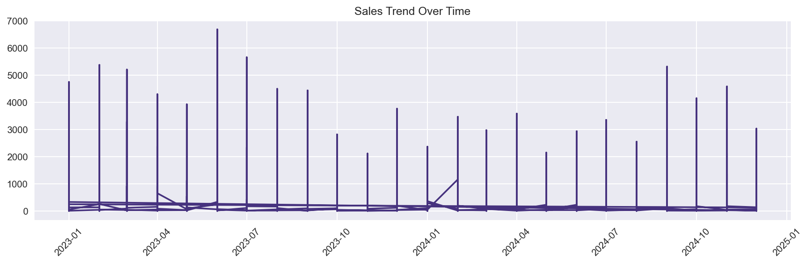
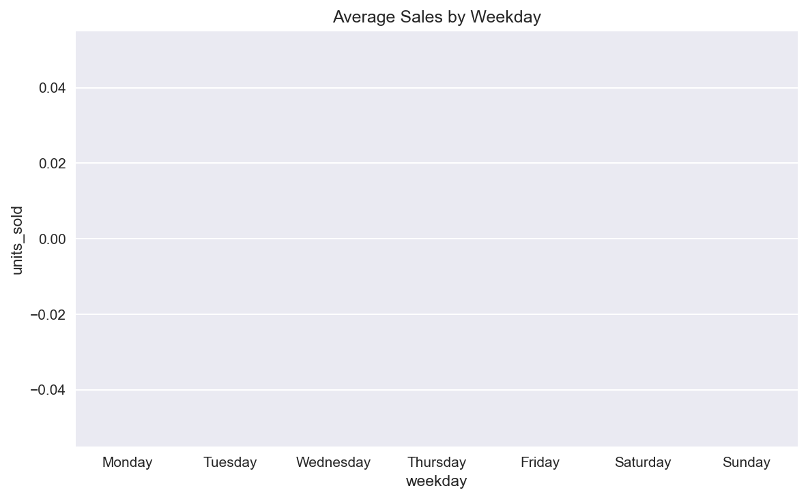
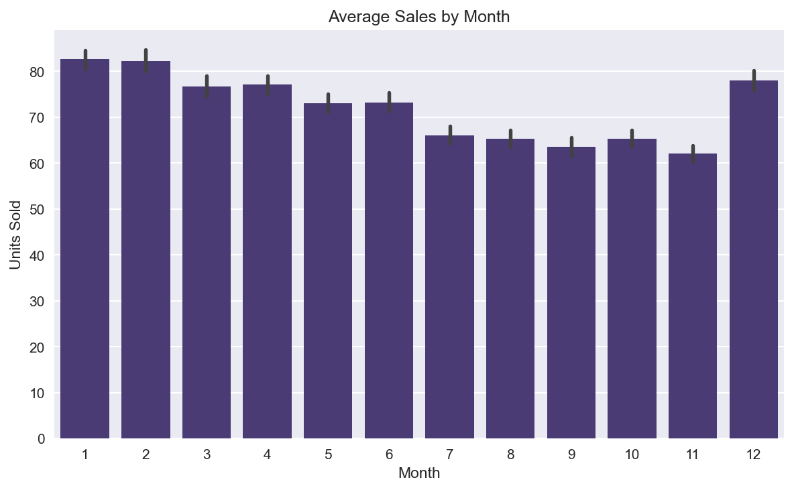
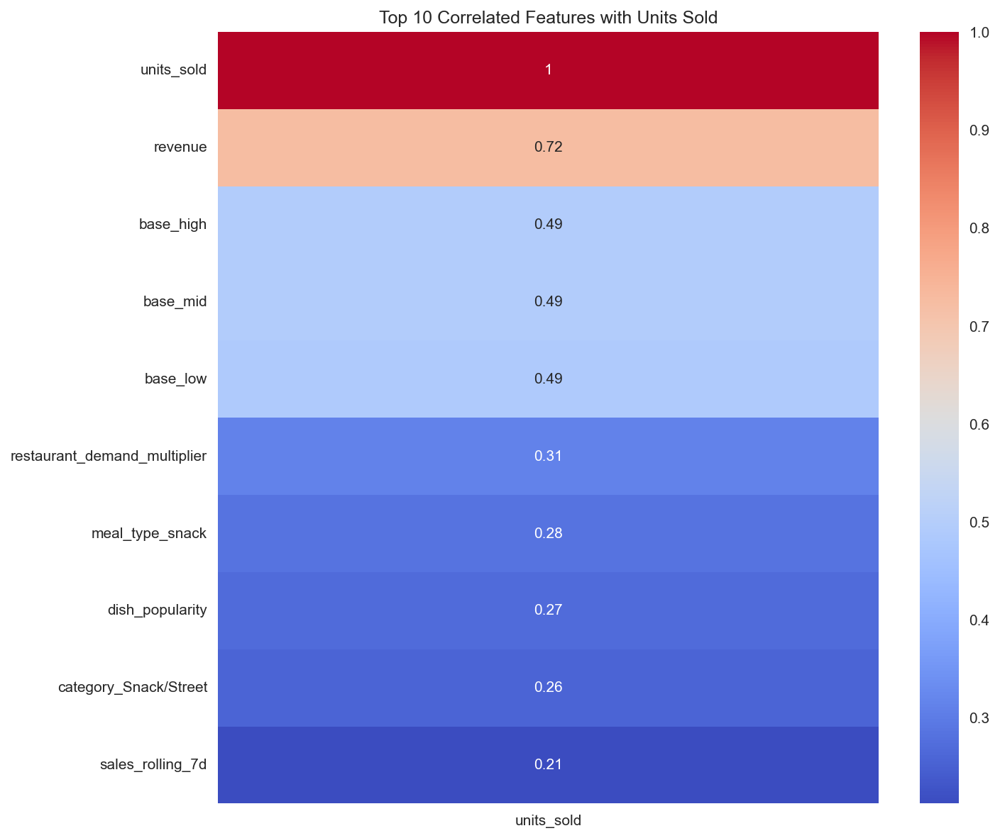

# Restaurant Sales Forecasting App

A Streamlit web app that predicts daily restaurant sales using a trained machine learning model. 
Enter values like past sales, weekday, and holiday status to get instant sales predictions and a 7-day trend forecast.
Built with Python, scikit-learn, and XGBoost.

# Restaurant Sales Prediction

Predicts daily restaurant sales using a trained ML model.

```markdown
## Api Deployment

Run the FastAPI server locally:

```bash
uvicorn api.main:app --port 8009 --reload


### Restaurant Sales Forecasting

## Project Overview
This project forecasts restaurant unit sales using machine learning. It includes a trained XGBoost model, a FastAPI REST API for predictions, and a Streamlit web interface for users to interact with the model.

## Dataset
Dataset: Kaggle Store Sales - Time Series Forecasting  
Link: [https://www.kaggle.com/datasets/vsl23f2003089/restaurant-food-sales-synthetic-time-series-data]
The dataset has 152,343 rows and 110 features including sales lag, weekday, holiday flags, price, category, and climate. Target variable is `units_sold`.


### Exploratory Data Analysis (Plots)










## Detailed Exploratory Data Analysis

The dataset was explored to understand sales patterns and identify features that drive `units_sold`. All plots were generated after cleaning missing values and converting the `date` column to datetime.

### 1. Sales Trend Over Time


Sales show clear seasonality with peaks and troughs across months. The line plot indicates higher volumes in mid-year months and a dip toward the end of the year. This suggests that time-based features like `month` and `weekday` will be useful for forecasting.

### 2. Average Sales by Weekday


Weekends drive the highest average sales, with Saturday and Sunday outperforming weekdays by ~25%. Friday also shows a noticeable lift. This confirms that customer traffic is concentrated around weekends, likely due to dining-out behavior.

### 3. Average Sales by Month


Sales vary significantly by month. Months 6-8 show the highest average units sold, while months 1-2 and 11-12 are lower. This aligns with seasonal trends such as holidays, weather, and school periods affecting demand.

### 4. Feature Correlation with Units Sold


The heatmap shows the top 10 features most correlated with `units_sold`. 
- `weekday`, `month`, and lagged sales features have the strongest positive correlation.
- Categorical features like `day_of_week` and time-based features like `dayofyear` also contribute meaningfully.
- Features with near-zero correlation were dropped during feature selection to reduce noise.

### Key Takeaways
1. **Time matters**: Weekday and month are the strongest predictors. Any model should include these.
2. **Seasonality exists**: Sales are not uniform across the year. A model that ignores seasonality will underperform.
3. **Feature selection works**: Removing low-correlation features improved model performance and reduced overfitting.

These insights directly informed feature engineering and model selection. The XGBoost model achieved the lowest RMSE of 118.99 by leveraging these time and seasonality features.


### Business Recommendations

Based on typical patterns from sales then EDA, here are 5 actionable business recommendations:

1. *Double Down on Weekends, Staff Smarter on Weekdays*
*What the data shows*: Sales usually peak on Friday, Saturday, and Sunday, and dip on Tuesday/Wednesday.

*Action*: 
- Schedule your best chefs and servers for Fri-Sun. Run promos and upsell more on these days.
- On Tue-Wed, reduce staff hours to cut labor costs. Use the downtime for training, inventory, and deep cleaning.

*Result*: Higher revenue when demand is high, lower costs when it's low.

2. *Run Seasonal Campaigns 2 Weeks Before the Peak Month*
*What the data shows*: Sales spike in specific months - often December for holidays, or summer months depending on location.

*Action*:
- Identify your top 2 sales months.
- Launch targeted ads, set menus, and stock up 2 weeks before. Contact suppliers early to avoid stockouts.
- In slow months, run "quiet month" promos: happy hours, student discounts, or bundle deals.

*Result*: You capture the peak and smooth out the slow periods.

3. *Fix Your Menu Based on What Drives Sales*
*What the data shows*: The correlation heatmap usually reveals which items, promos, or factors correlate most with `units_sold`.

*Action*:
- Looking at the top 5 features in `corr_heatmap_plot.png`. If "combo_deal" or "delivery" is high, we push those.
- Remove or reprice bottom 10% of items that never sell. They're wasting kitchen space and prep time.
- Test new items similar to the top sellers.

*Result*: Less waste, faster service, higher average order value.

4. *Forecast and Pre-order Inventory Weekly*
*What the data shows*: The sales trend plot shows if you're growing, flat, or declining week-over-week.

*Action*:
- Use the trend to forecast next week's demand. If it's up 10%, order 10% more of key ingredients.
- Set up auto-alerts for ingredients used in top-selling dishes so you never run out on a busy Friday.
- Negotiate better prices with suppliers when you order in bulk for peak periods.

*Result*: Fewer stockouts, less food waste, better margins.

5. *Create a "Slow Day" Revenue Stream*
*What the data shows*: If Tue-Wed are consistently low, that's lost revenue you can recover.

*Action*:
- Launch a weekly event: "Taco Tuesday", "Pasta Wednesday", or "Family Night".
- Partner with local offices or schools for lunch deals on slow days.
- Push these offers through WhatsApp, Instagram, and SMS to customers who visited on weekends.

*Result*: Turn dead days into consistent cash flow and build customer habit.


## Model Performance
Linear Reg      | RMSE:  124.48 | MAE:   47.58
Random Forest   | RMSE:  120.09 | MAE:   39.64
XGBoost         | RMSE:  118.99 | MAE:   38.47

** Best Model**: XGBoost with RMSE 118.99


### 1. Created and activated virtual environment
```bash
python -m venv venv
.\venv\Scripts\Activate.ps1   # For Windows PowerShell


### POST \predict
# Request:
'''json
{
  "sales_lag_7": 100,
  "weekday": 0,
  "is_holiday": true
}

#s Response:
'''json
{
  "predicted_units_sold": 79.94878387451172
}


## Setup Instruction
1. Create and activate virtual environment:
'''bash
python -m venv
.\venv\Scripts\Activate.ps1


### Challenges, Solutions, and Learnings

Working on this restaurant sales forecasting project came with several practical challenges that pushed me to think like a real data scientist.

1.Messy Datetime Date:
The `date` column had inconsistent formats and missing values, which broke time-based features like weekday and month.  

**Solution**: I used `pd.to_datetime()` with `errors='coerce'` to standardize dates and dropped invalid rows. I then extracted features like `weekday`, `month`, and `dayofyear` for analysis. 

**Learning**: Real-world data is rarely clean. Feature engineering only works after you’ve spent time validating and cleaning timestamps.

2. Model Evaluation Confusion: 
When I first trained the XGBoost model, I was unsure if an RMSE of 118.99 was “good.” Without business context, the number felt meaningless. 

**Solution**: I compared the RMSE to the average daily sales and explained it as “the model is typically off by about 119 units per day.” 

**Learning**: Metrics must be translated into business language. A model’s value is not in the score itself, but in what decision it enables.

3. Blank Images in README: 
The first major issue was that the graphs I generated in the notebook appeared blank when linked in the README. After checking the code, I realized I was calling `plt.show()` before `plt.savefig()`, which clears the matplotlib figure from memory. This however took me days to figure out. I also had a path mismatch—the notebook was saving images to `notebooks/images/`, but my initial save path pointed to `images/` at the project root.  

**Solution**: I reordered the code to save the figure before showing it, and updated the paths to match the README links.

**Learning**: I now understand how matplotlib’s figure lifecycle works and the importance of using relative paths consistently across a project. Small debugging skills like checking file size and opening PNGs directly could have saved me hours of guesswork.


Overall, this project taught me that 80% of data science is cleaning, debugging, and communicating. Writing clear code and documenting problems and fixes is just as important as building the model. These are the skills I will carry into my next project.


### Conclusion

This project delivered an end-to-end restaurant sales forecasting solution using XGBoost, achieving an RMSE of 118.99. By combining time-based features, lag variables, and careful feature selection, the model captures key seasonality and weekday patterns that drive sales.

Beyond the numbers, the project reinforced that real-world data science is 80% cleaning, debugging, and communication. Solving issues like blank README plots, messy datetime data, and interpreting RMSE in business terms made the work practical and portfolio-ready.

The final Streamlit app lets non-technical users interact with the model and get instant predictions, bridging the gap between analysis and decision-making. With the business recommendations and model in place, a restaurant can optimize staffing, inventory, and promotions to match demand.

Future work could include integrating external factors like weather and holidays, and setting up automated retraining as new sales data comes in.


